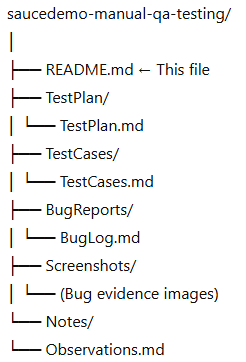

# 🧪 SauceDemo Manual QA Testing Project

This project documents a **manual Quality Assurance (QA) testing process** performed on [SauceDemo.com](https://www.saucedemo.com/), a sample e-commerce web application used for testing and training purposes.  

The goal of this project is to demonstrate structured QA practices — from **test planning** to **execution**, **bug reporting**, and **continuous improvement** — following industry-standard methodologies.

---

## 📋 Project Overview

**Objective:**  
To evaluate the core functionality, usability, and reliability of SauceDemo’s web application through systematic manual testing.

**Scope:**  
The test cycle covers:
- Login functionality  
- Inventory and product browsing  
- Cart and checkout flow  
- Session handling and logout  
- UI/UX behaviour across browsers  

---

## 🧰 Tools & Technologies

| Category | Tool / Platform                    |
|-----------|------------------------------------|
| Test Management | Jira / AIO Tests                   |
| Issue Tracking | Jira (mock environment)            |
| Browser Testing | Chrome, Firefox                    |
| OS | Windows 11                         |
| Repository | GitHub                             |
| Documentation | Markdown (Test Cases, Bug Reports) |

---

## 🔍 Test Deliverables

| Deliverable | Description |
|--------------|-------------|
| **Test Plan** | Defines objectives, scope, and testing approach |
| **Test Cases** | Detailed manual test scenarios with preconditions, steps, and expected results |
| **Bug Reports** | Documented defects found during execution with reproduction steps and screenshots |
| **Screenshots** | Visual evidence of issues |
| **Summary Report** | Overview of key findings and recommendations |

---

## 🧾 Folder Structure

---

## ✅ Testing Approach

Testing was conducted using a combination of:
- **Functional Testing** – validating expected application behaviours.
- **Regression Testing** – verifying previously working features after fixes.
- **Exploratory Testing** – identifying potential usability issues beyond scripted test cases.
- **Boundary Testing** – checking limits of input fields and validation messages.

---

## 🐛 Example Findings

| Bug ID | Description | Severity | Status |
|--------|--------------|-----------|---------|
| BUG-001 | Login fails with valid credentials using Firefox | Major | Open |
| BUG-002 | Incorrect price total displayed in cart | Critical | Fixed |
| BUG-003 | Logout button misaligned on mobile view | Minor | Open |

---

## 📈 Key Learnings

- Reinforced structured manual QA process and documentation best practices.  
- Practised clear, reproducible bug reporting with evidence.  
- Gained insight into common e-commerce test flows (authentication, cart, checkout).  
- Improved use of Markdown and GitHub for professional portfolio presentation.  

---

## 💡 Future Enhancements

- Expand coverage with **automated test cases** (using Playwright / Selenium).  
- Integrate with **Jira or TestRail** for formal test management.  
- Add **API testing** for backend validation using Postman or Python scripts.  

---

## 👤 Author

**Name:** Michael Lozynsky  
**Role:** QA Engineer / Test Analyst  
**LinkedIn:** https://www.linkedin.com/in/michael-lozynsky-a81187125/
**Portfolio:** [streamlit-app-link]

