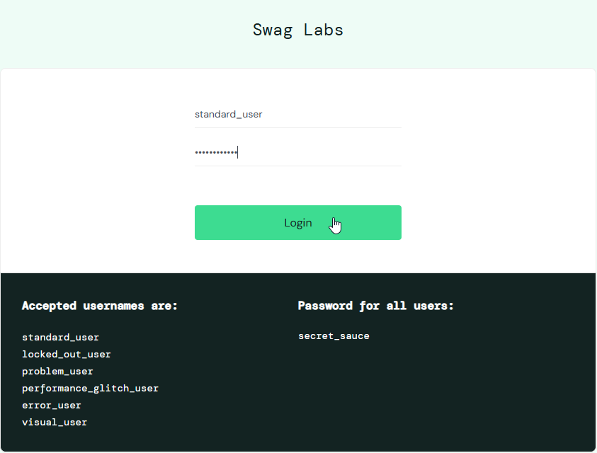
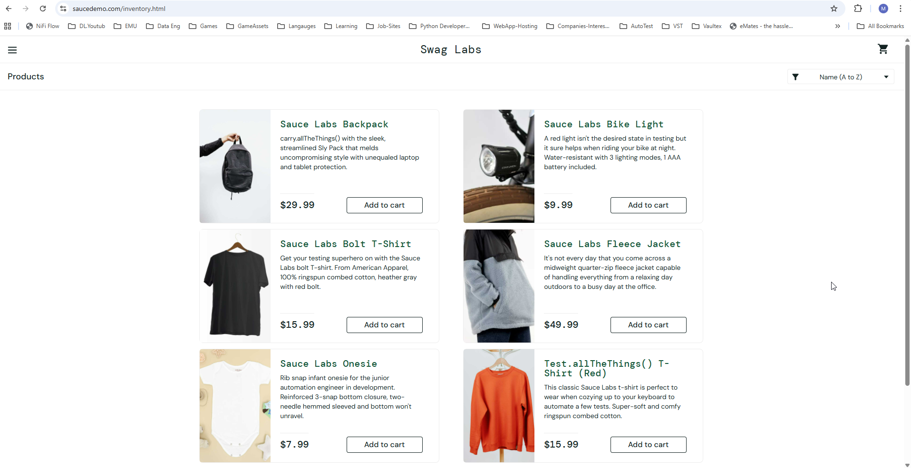
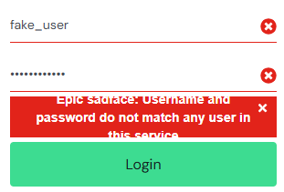

# 🧪 SauceDemo Manual Test Cases

This document contains 10 manual test cases for functional testing of the [SauceDemo](https://www.saucedemo.com/) web application.  
All tests are designed to verify key user workflows — login, product selection, cart, and checkout.

---

## 📁 Test Summary

| ID | Feature Area | Test Title | Priority | Status |
|----|---------------|-------------|-----------|---------|
| TC01 | Login | Valid user login | High | Not Executed |
| TC02 | Login | Invalid user login | High | Not Executed |
| TC03 | Inventory | Verify inventory item details | Medium | Not Executed |
| TC04 | Inventory | Add item to cart | High | Not Executed |
| TC05 | Cart | Remove item from cart | Medium | Not Executed |
| TC06 | Cart | Verify total price accuracy | High | Not Executed |
| TC07 | Checkout | Complete checkout with valid data | High | Not Executed |
| TC08 | Checkout | Attempt checkout with missing fields | Medium | Not Executed |
| TC09 | UI | Verify product image and label alignment | Low | Not Executed |
| TC10 | Logout | Verify successful logout | Medium | Not Executed |

---

## 🧩 Detailed Test Cases

---

### **TC01 – Valid User Login**
**Feature:** Login  
**Precondition:** User is on the SauceDemo login page  
**Test Steps:**
1. Enter valid username `standard_user`  
2. Enter valid password `secret_sauce`  
3. Click **Login** button  
**Expected Result(s):**  
User is redirected to the Inventory page.  
The product list is displayed.  
All Images and page elements display

**Test Evidence**

Test Outcome: PASS

---

### **TC02 – Invalid User Login**
**Feature:** Login  
**Precondition:** User is on the login page  
**Test Steps:**
1. Enter invalid username `fake_user`  
2. Enter valid password `secret_sauce`  
3. Click **Login**  
**Expected Result:**  
An error message appears: *“Epic sadface: Username and password do not match any user in this service.”*  

**Test Evidence**  

Test Outcome: FAIL  
Comments: Although the Actual Result matches the Expected Result
the text of the error message is not displayed correctly making it difficult for the User to read, I raised a visual / layout bug on this and recommended thee red background box is expanded vertically to allow for the error message to be displayed properly making for a better user experience and improving quality.

---

### **TC03 – Verify Inventory Item Details**
**Feature:** Inventory Page  
**Precondition:** User is logged in  
**Test Steps:**
1. Observe displayed products  
2. Check that each product has a name, description, price, and image  
3. Click on one product name  
**Expected Result:**  
Product details page displays correct title, price, description, and matching image.  

---

### **TC04 – Add Item to Cart**
**Feature:** Inventory Page  
**Precondition:** User is logged in on the Inventory page  
**Test Steps:**
1. Click “Add to cart” on any product  
2. Check the cart icon at the top right  
3. Click on the cart icon  
**Expected Result:**  
Cart icon shows “1”; the cart page lists the added product.  

---

### **TC05 – Remove Item from Cart**
**Feature:** Cart Page  
**Precondition:** User has at least one product in cart  
**Test Steps:**
1. Navigate to cart  
2. Click “Remove” on one item  
3. Observe the cart contents  
**Expected Result:**  
Selected product is removed and cart count updates accordingly.  

---

### **TC06 – Verify Total Price Accuracy**
**Feature:** Cart Page  
**Precondition:** User has multiple items in cart  
**Test Steps:**
1. Add two or more products  
2. Go to the cart  
3. Verify displayed total matches sum of individual prices  
**Expected Result:**  
Total equals the combined price of listed products (excluding taxes/shipping).  

---

### **TC07 – Complete Checkout with Valid Data**
**Feature:** Checkout Flow  
**Precondition:** User has at least one product in cart  
**Test Steps:**
1. Click “Checkout”  
2. Enter valid First Name, Last Name, and Postal Code  
3. Click “Continue”  
4. Review summary and click “Finish”  
**Expected Result:**  
Order is successfully placed and confirmation message appears: *“Thank you for your order!”*  

---

### **TC08 – Attempt Checkout with Missing Fields**
**Feature:** Checkout Flow  
**Precondition:** User is on Checkout page  
**Test Steps:**
1. Leave one or more mandatory fields blank  
2. Click “Continue”  
**Expected Result:**  
An appropriate validation error is shown, preventing progress to the next step.  

---

### **TC09 – Verify Product Image and Label Alignment**
**Feature:** UI / Visual Testing  
**Precondition:** User is on the Inventory page  
**Test Steps:**
1. Scroll through product list  
2. Check that images, names, and prices are correctly aligned in grid view  
**Expected Result:**  
No overlap or misalignment of images, names, or buttons. Layout consistent across browsers.  

---

### **TC10 – Verify Successful Logout**
**Feature:** Logout  
**Precondition:** User is logged in  
**Test Steps:**
1. Click on the menu (three-bar icon)  
2. Select “Logout”  
3. Observe navigation  
**Expected Result:**  
User is redirected back to the login page. Session data is cleared.  

---

## 🧭 Notes
- Browser tested: Chrome (vLatest)
- OS: Windows 10
- Environment: [https://www.saucedemo.com](https://www.saucedemo.com)

---

**Author:** [Your Name]  
**Date:** [Insert Date]  
**Version:** 1.0
